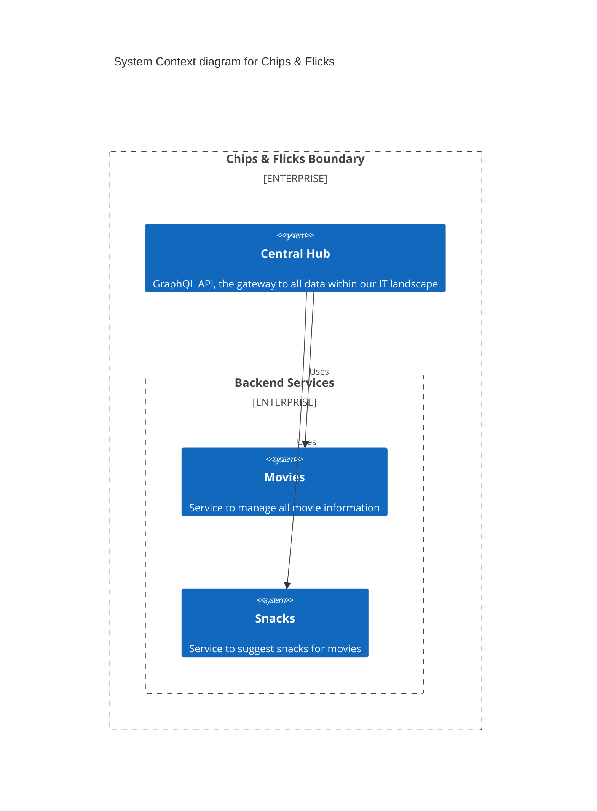
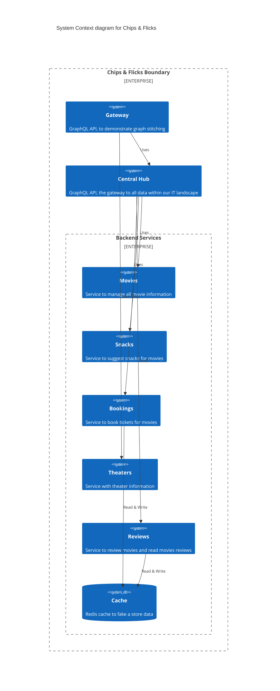
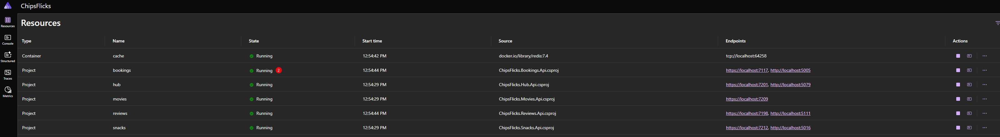
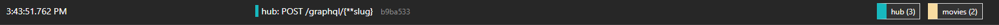

# Chips & Flicks

This is a simple web application with multiple services. The start architecture is simple:



The end result is a bit more complex:


And with stiching:


This workshop is divided into multiple subjects, each with its own branch. The subjects are:

- [Basic Setup + REST](https://github.com/jacobduijzer/graphql-workshop)
- [GraphQL Setup + Queries](https://github.com/jacobduijzer/graphql-workshop/tree/graphql)
- [Resolvers + Data Loaders](https://github.com/jacobduijzer/graphql-workshop/tree/resolvers)
- [Mutations](https://github.com/jacobduijzer/graphql-workshop/tree/mutations)
- [Subscriptions](https://github.com/jacobduijzer/graphql-workshop/tree/subscriptions)
- [Stitching](https://github.com/jacobduijzer/graphql-workshop/tree/stitching)

## Getting started

This project uses [.NET Aspire](https://learn.microsoft.com/en-us/dotnet/aspire/). To start the project, start the ChipsFlicks.AppHost https project. This will start all the projects, including a dashboard.



## Basic Setup + REST


## GraphQL Setup + Queries

In this branch, the REST API is replaced with a GraphQL API. The GraphQL API is defined in the `ChipsFlicks.Hub` project. It still calls REST API's from the microservices.

Just start the project and play around with the queries. Some examples:

```grapgql
{ 
  all {
      title
      genre
      type
  }
}
```

```graphql
{ 
  genres 
}
```

```graphql
{ 
  recommendation(genre: "Crime", type: "movie") 
} 
```

```graphql
{ 
  a: byGenre(genre: "Crime") {
    title
  }
  b: byGenre(genre: "Horror") {
    title
  }
} 
```

.NET Aspire comes with tracing and logging out of the box. Pay attention to the traces, when you execute the last query, you can see two REST calls being executed to fetch movies for each genre.



We will dive in this in the next branch, where we will implement resolvers and data loaders.

## Resolvers + Data Loaders

## Mutations

```graphql
mutation {
  addReview(review:  {
     content: "Nice movie",
     rating: 4,
     reviewer: "John Doe",
     title: "Inception"
  }) {
    title
    rating
  }
}
```

## Subscriptions

```graphql
mutation {
  addBooking(booking:  {
     title: "Inception",
     numberOfPeople: 3,
     eventDate: "2024-11-19"
  })
}
```

```graphql
subscription {
  bookingAdded {
     bookingNumber
     booking {
      title
     }
  }
}
```

## Stitching

N.B.: I had to downgrade to HotChocolate 13.9.14 to get stitching to work.

N.B.: Subscriptions are not working yet with stitching (or: I didn't get it working).

```csharp

```graphql
{
    theaters {
        name
        city
        openingHours
    }

    movies {
        title
        reviews {
            rating
        }
        snackRecommendation
    }
}
```


