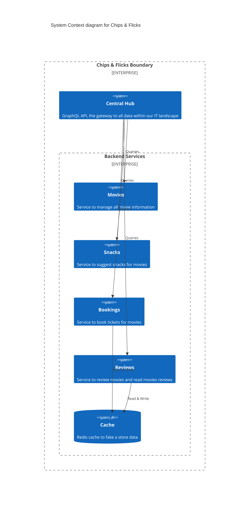

# Chips & Flicks

This is a simple web application with multiple services. The start architecture is simple:


The end result is a bit more complex:


This workshop is divided into multiple subjects, each with its own branch. The subjects are:

- [Basic Setup + REST](https://github.com/jacobduijzer/graphql-workshop)
- [GraphQL Setup + Queries](https://github.com/jacobduijzer/graphql-workshop/tree/graphql)
- [Resolvers + Data Loaders](https://github.com/jacobduijzer/graphql-workshop/tree/resolvers)
- [Mutations](https://github.com/jacobduijzer/graphql-workshop/tree/mutations)
- [Subscriptions](https://github.com/jacobduijzer/graphql-workshop/tree/subscriptions)

## Getting started

This project uses [.NET Aspire](https://learn.microsoft.com/en-us/dotnet/aspire/). To start the project, start the ChipsFlicks.AppHost https project. This will start all the projects, including a dashboard.


## Basic Setup + REST


## GraphQL Setup + Queries

## Resolvers + Data Loaders

## Mutations

## Subscriptions

```graphql
mutation {
  addBooking(booking:  {
     title: "Inception",
     numberOfPeople: 3,
     eventDate: "2024-11-19"
  })
}
```

```graphql
subscription {
  bookingAdded {
     bookingNumber
     booking {
      title
     }
  }
}
```

